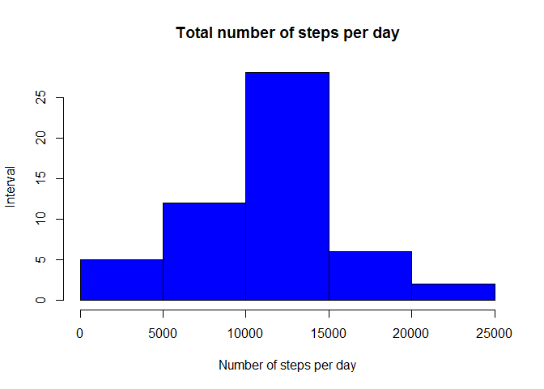
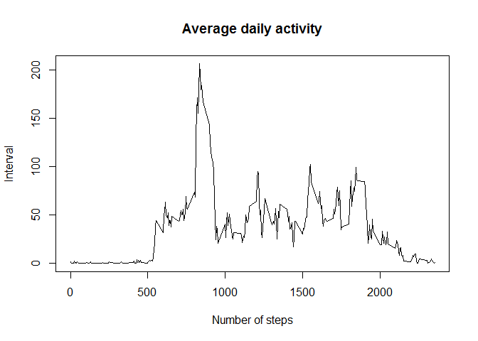
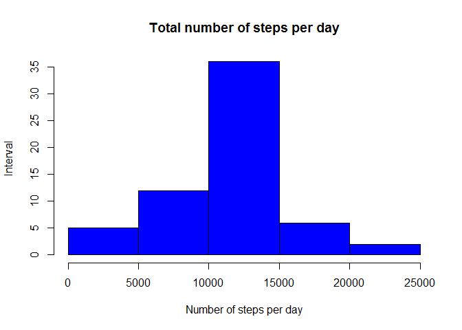
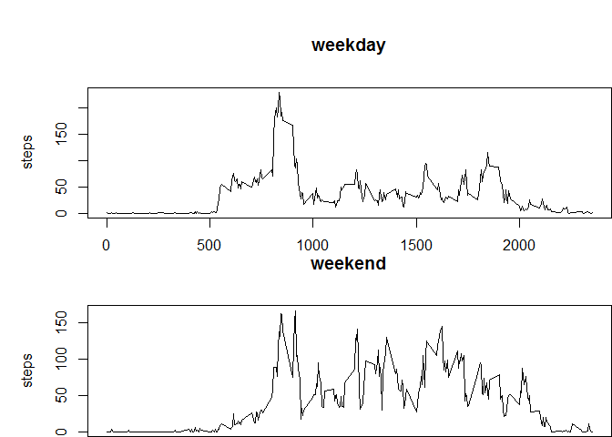

# Reproducible Research: Peer Assessment 1


## Loading and preprocessing the data

```r
setwd("C:/Users/Skynet/Documents")
activity <- read.csv("activity.csv")
```

## What is mean total number of steps taken per day?

```r
totalstepsperday <- tapply(activity$steps, activity$date, sum)
hist(totalstepsperday, main = "Total number of steps per day", 
    xlab = "Number of steps per day", ylab = "Interval", col = "blue")
```

 

```r
#Mean total number of steps taken per day:
mean(totalstepsperday, na.rm = T)
```

```
## [1] 10766.19
```

```r
#Median total number of steps taken per day:
median(totalstepsperday, na.rm = T)
```

```
## [1] 10765
```

## What is the average daily activity pattern?

```r
AvgStepsPerInterval <- tapply(activity$steps, activity$interval, mean, na.rm = T)
plot(AvgStepsPerInterval, type = "l", main = ("Average Steps x Interval"), 
    ylab = "# of steps")
```

 

```r
#Interval with the maximum number of steps:

seq(along = AvgStepsPerInterval)[AvgStepsPerInterval == max(AvgStepsPerInterval)]
```

```
## [1] 104
```

## Imputing missing values

Total missing values in dataset:

```r
sum(as.numeric(is.na(activity$steps)))
```

```
## [1] 2304
```

```r
# Methid for filling in all of the missing values in the dataset.
# 1.Get average steps per interval as vector and repeat for each of the 61 days
sub_AvgStepsPerInterval <- as.vector(AvgStepsPerInterval)
sub_AvgStepsPerInterval <- rep(sub_AvgStepsPerInterval, 61)

# 2.To fill in missing data by setting it to places that are missing
sub_AvgStepsPerInterval[!is.na(activity$steps)] = 1

# 3.Get the steps data as vector
sub_Data <- as.vector(activity$steps)
# 4.To fill in missing data by setting it to places that are missing
sub_Data[is.na(sub_Data)] = 1
complete_data <- activity
complete_data$steps <- sub_AvgStepsPerInterval * sub_Data

#Histogram of the total number of steps taken each day
complete_data_steps<- tapply(complete_data$steps, complete_data$date, 
    sum)
hist(complete_data_steps, main = "Total number of steps per day", 
    xlab = "Number of steps per day", ylab = "Interval", col = "blue")
```

 

```r
#Mean total number of steps taken per day: 
mean(complete_data_steps)
```

```
## [1] 10766.19
```

```r
#Median total number of steps taken per day:
median(complete_data_steps)
```

```
## [1] 10766.19
```

The mean values are identical except the median which has a difference of 1 from the estimates from the first part of the assignment

The impact of the missing data on histogram is that the number (Interval) of data in the middle of histogram has increased as the missing data has been filled with new data with the mean.


## Are there differences in activity patterns between weekdays and weekends?


```r
# Create a new factor variable in the dataset with two levels -- "weekday" and "weekend" indicating whether a given date is a weekday or weekend day.

days <- weekdays(as.Date(activity$date)) %in% c('Saturday','Sunday')
# Create the factor variable in the dataset in 2 levels
activity$weekday <- factor(days, labels = c("weekday", "weekend"))

# Make a panel plot containing a time series plot (i.e. type = "l") of the 5-minute interval (x-axis) and the average number of steps taken, averaged across all weekday days or weekend days (y-axis). See the README file in the GitHub repository to see an example of what this plot should look like using simulated data.
par(mfrow = c(2, 1))
for (type in c("weekday", "weekend")) {
    steps.type <- aggregate(steps ~ interval, data = activity, subset = activity$weekday == 
        type, FUN = mean)
    par(mai = c(0, 1, 1, 0))
    plot(steps.type, type = "l", main = type)
}
```

 


On weekdays, it's apparant that more activities occurs in the morning period due to working lifestyle while on the weekends, the activities are more equally distributed throughout the day perhaps due to having more free time or non working days.

